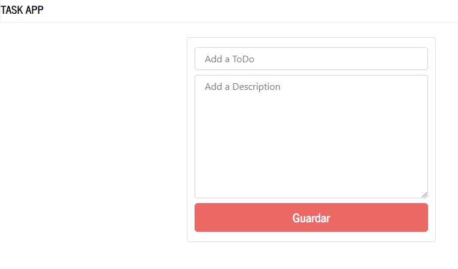
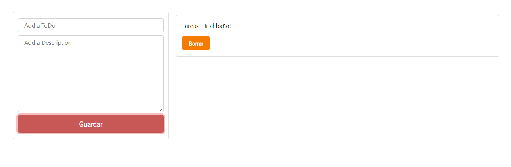
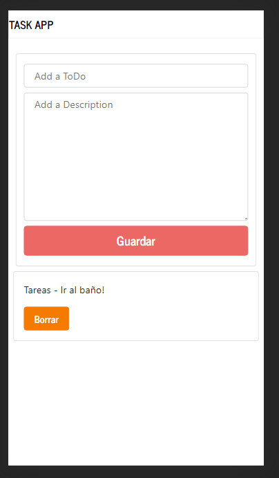

# Lista de Tareas
* *Uso de CSS, FlexBox, diseño responsivo y JS*
* * * 

Se le puede incluir

- [ ] Creación de Subtareas

- [ ] Edición de tareas existentes

* * * 
Capturas:

# Web

# Responsive

